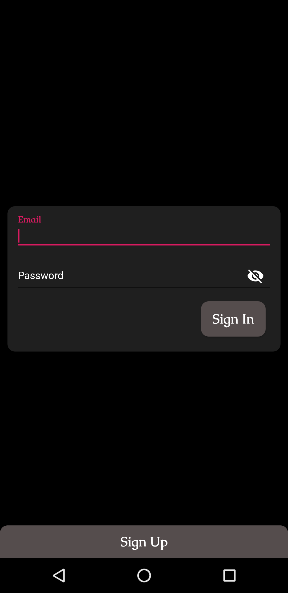
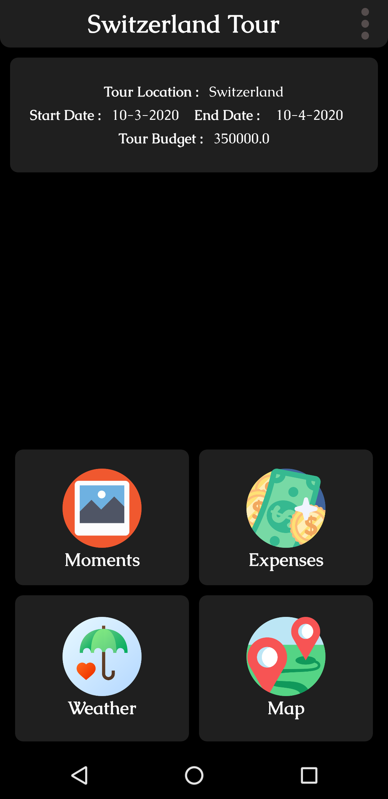
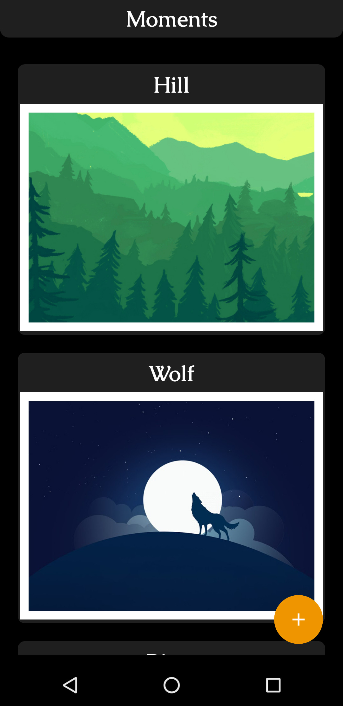
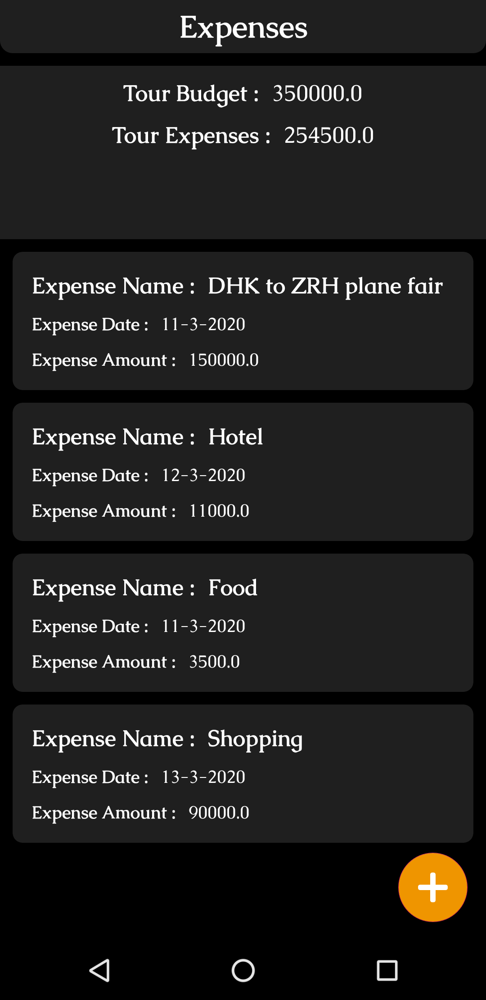
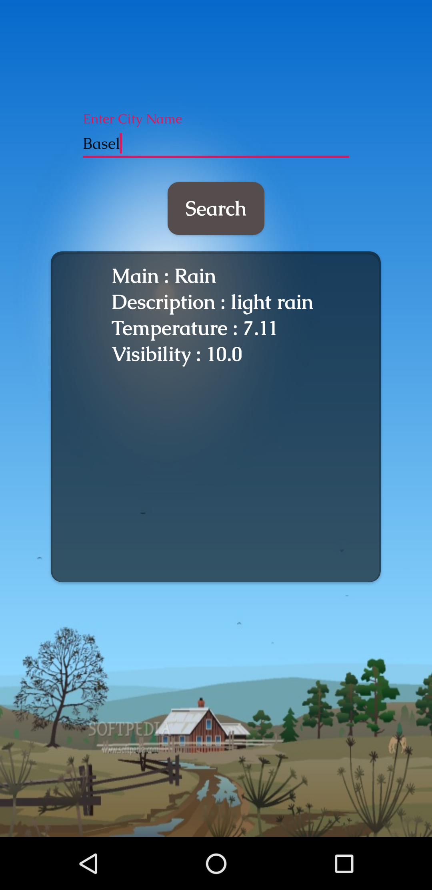
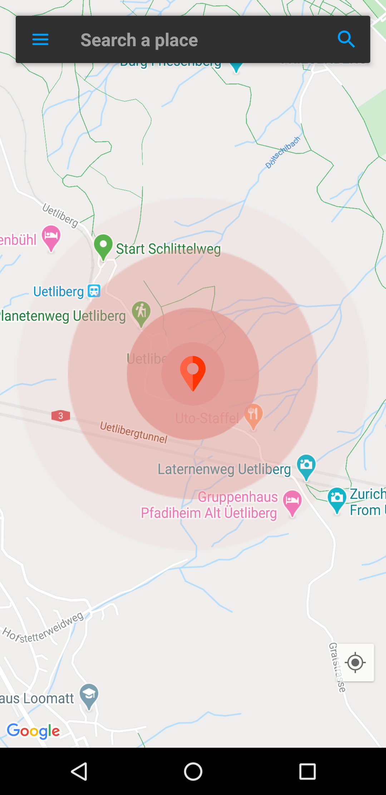

  

<h3 align="center">Tour Friend</h3>

  Tour Friend app rudimentary an application which you can utilize while you are make a tour.
  

## Table of contents

- [Features](#Features)
- [Screenshots](#Screenshots)

## Features

- Crating a tour and tour history available
- Calculate tour expense to efficient the cost
- Save moments
- Weather of desired location
- Get map support at anywhere

## Screenshots

                                         

